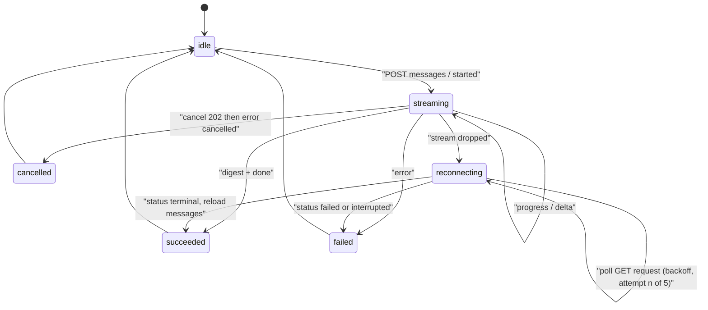

# Milestone 8B: Web Frontend — Design

**Created:** 2026-10-06
**Follow-on to:** Milestone 8A.1 (`2026-09-11-milestone-8a1-web-api-and-sessions-design.md`) and Prototype Backend Alignment (`2026-10-05-prototype-backend-alignment-design.md`)
**ADR:** `docs/adr/0010-web-story-mode-and-session-source-preferences.md`
**Status:** draft for review. The implementation plan is written separately.

## Goal

Port the approved OpenDesign prototype (`research-chat-prototype.html`, project "AI News Research Agent") into a Vue 3 application in `frontend/`. Every screen binds to the real `/api/v1` contract through view-models. A small additive backend slice closes the data gaps between the prototype and the API.

## Non-goals

- Redesigning screens, adding screens, or inventing a second brand.
- Authentication, deployment, public hosting, media proxying.
- Semantic session search (8A.2).
- Zhihu/Bilibili author avatars.
- Translating prototype CSS/JS motion into `motion/react` or another animation library.
- Removing Gradio (stays until 8B is accepted).

## Sources of truth

| Question | Winner |
|---|---|
| Does a screen, field or action exist? | This spec and `CONTEXT.md` |
| Look of an approved screen (layout, type, density, motion) | Prototype and its token blocks |
| Data shape, IDs, pagination, errors | The `/api/v1` OpenAPI contract |
| Empty / loading / error / forbidden states | Real states, styled like the prototype |

Prototype artifacts: `research-chat-prototype.html` is the only approved file. `research-chat-prototype-v1.html` and `ui-themes-motion-exploration.html` are earlier drafts and are not used. `image.png` is only a motion reference for the circular-reveal theme switch. The project has no design-system id, so the token source of truth is the `:root` and `[data-theme=dark]` blocks (prototype lines 12-51). Source logos are copied from `assets/sources/*`.

The prototype review strip (`.proto`), its state buttons and the "Fake mode" toggle are review-only and are not ported.

## Stack and structure

Vue 3, Vite, TypeScript, Tailwind CSS, shadcn-vue, Vitest. Location: `frontend/` at the repo root, Vite dev server on `:5173` (already in the CORS allowlist). The API base URL comes from `VITE_API_BASE_URL`, default `http://127.0.0.1:8765`.

```text
frontend/
  src/
    api/          # generated client, sse.ts (POST SSE reader), request lifecycle
    vm/           # Vm types, toVm mappers, toVmFromFixture (fixtures only)
    components/   # sidebar, chat, digest, composer, history, ui primitives
    stores/       # session, thread, composer, history, theme
    styles/       # tokens.css, motion.css
    assets/sources/  # logos from the prototype
```

The typed client is generated from the FastAPI OpenAPI document. The generator tool is chosen in the implementation plan. SSE is read with `fetch` plus a `ReadableStream` reader, because `EventSource` cannot POST. The frame format is `event: {name}\ndata: {json}\n\n`, with no `id:` or `retry:`.

## Tokens and theming

- Copy the two token blocks verbatim into `frontend/src/styles/tokens.css` (oklch values, `--d1/--d2/--d3`, `--stagger`, `--ease`, shadows, frost and scrim variables).
- Tailwind maps only to these CSS variables. No guessed palette or spacing scale where the prototype specifies a value.
- shadcn-vue primitives are restyled with tokens. Default shadcn chrome is not kept. Buttons, inputs, dialogs and switches match the prototype's `.btn`, `.input`, `.theme-sw`, `.sess-confirm` rules.
- Keep the pre-paint script in `index.html`: reads `localStorage['anra-theme']`, else `prefers-color-scheme`, sets `data-theme` on `<html>`. Follow OS changes only while no stored choice exists.
- Circular reveal: literal port of `setTheme`. View Transition, 600 ms, `cubic-bezier(.25,.8,.3,1)`, `clip-path` circle from the pointer position (pointer activation) or from the theme control (keyboard). Growing circle on the new view when switching to dark, shrinking circle on the old view when switching to light. Fallback is an instant switch under `prefers-reduced-motion` or without `startViewTransition`. The `.theme-snap` rule suppresses transitions during the swap.
- Fonts: system stack for display and body, JetBrains Mono (400, 500) for mono.

## App shell and responsive layout

Grid `264px minmax(0,1fr) 0`, becoming `264px minmax(0,1fr) 372px` when history is open. The transition is `grid-template-columns var(--d3) var(--ease)`. Height is `100vh` (the prototype's 40px review strip is removed).

| Breakpoint | Behavior |
|---|---|
| >= 1280 | History open by default, as a third column |
| <= 1279 | History becomes a fixed right overlay (`min(392px,92vw)`, frosted) with a scrim |
| <= 899 | Sidebar becomes a fixed left overlay (`min(300px,86vw)`) with a menu button; single column |
| <= 620 | Juya issue cover stacks above its meta |
| <= 560 | Button labels hidden; run steps drop the timestamp column |

The thread is `max-width: 880px`, centered. The composer dock is absolutely positioned at the bottom of `.chat`. A `ResizeObserver` writes its height into `--dock-h`, and the thread's bottom padding uses it. The dock's right offset equals the thread's scrollbar width.

## Screen and component inventory

Anchors are the prototype `data-od-id` values.

### Sidebar (`session-sidebar`)

| Element | Anchor | API | Vm fields |
|---|---|---|---|
| Session list | `session-{id}` | `GET /sessions` (cursor pagination, newest `updated_at` first) | `id`, `title`, `updatedAt`, `digestCount`, `busy` |
| New conversation | `new-conversation` | `POST /sessions`. Reuse an existing empty session instead of creating another, and flash it | - |
| Search | `session-search` | `GET /sessions/search?q=` (client debounce; hits show `excerpt`, `match_kind`) | `sessionId`, `title`, `excerpt` |
| Rename | inline form | `PATCH /sessions/{id}` `{title}` | `title` |
| Delete | `delete-confirm` | `DELETE /sessions/{id}`. `409 session_busy` shows "Cancel the running request first" and keeps the session | - |
| Theme switch | `theme-switch` | none (local) | `theme` |
| Backend status | `backend-status` | `GET /health` (`fake`) | `fake`, `reachable` |

A null title renders as "New conversation" in the muted italic empty style. Groups are "Today" and a month label derived from `updated_at`. Grouping uses real dates, not the prototype's hard-coded 2026-10-01.

### Chat head

Title (`conversation-title`), digest count or "Empty", `FAKE MODE` badge (`fake-mode-badge`, shown only when `/health` returns `fake: true`), theme toggle (`theme-toggle`), history toggle (`history-toggle`, `aria-pressed`, `aria-controls="history"`).

### Thread

Messages come from `GET /sessions/{id}/messages` (newest page first, rendered chronologically, "load older" via `next_cursor`).

| Kind | Detection (no `kind` field on the wire) | Component |
|---|---|---|
| User | `role=user` | bubble, plus source chips only for messages sent in the current page session |
| Digest | assistant, `digest` populated | digest reply |
| Markdown reply | assistant, `run_id` null, `digest` null | sanitized markdown (`markdown-reply`) |
| Cancelled | request `status=cancelled` / content `"The request was cancelled."` | `cancelled-reply` with "Run again" |
| Failed | request `status=failed` | danger alert with the safe message |
| Interrupted | request `status=interrupted` (usually no assistant row) | info alert "This request was interrupted by a restart" with "Run again" |
| Empty | no messages | `empty-conversation` with three suggestion buttons |

"Run again" refills the composer with the last user message and focuses it. It never resends automatically.

### Digest reply (`digest-reply`)

- Header: "Digest", `dN` ref, `generated_at`, item count, "X of Y sources returned results" (Y from the session's selected sources plus warnings).
- Connector warnings: `alert-warn` per warning (`connector-warning-{source}`).
- Sections follow `entries` order, grouped by contiguous `source_kind`, each showing the continuous `display_rank` range. Header: source tile, source name, subtitle, item count, `#a-b` range.
- Juya: group stories under one issue cover (`juya-issue-cover`) keyed by `issue.id`. Cover image from `issue.cover_url`, alt text from `issue.lead_title`. Eyebrow shows "AI 早报 · {issue.date}" with no issue number. Story rows show `story.section` as the topic and a link to `story.original_url`.
- Entry rows (`entry-{kind}-{rank}`): rank, avatar, linked title, source tag, host link, Summary / Why it matters definition pair, "Ask a follow-up" (`followup-{kind}-{rank}`).
- GitHub: `owner.avatar_url`, meta line `language · stars ★ · +stars_today today`, hover or focus preview card from `preview_image_url` (400 ms delay, 320px, hidden on scroll and Escape). Omit any null segment, including `+N today` when `stars_today` is null.
- Hugging Face: comparison table (`hf-comparison-table`) with Rank, Model, Link, Trending (`trending_score`), 30-day downloads, Likes, Pipeline, Variants. Variants column shows `base_model` (additive field) and `family_variants`. The note line is kept.
- Avatars: image from `owner.avatar_url`. When null, `owner.type == "person"` shows a monospace initials tile (title "Personal account"). Organisation without an image shows a neutral tile.
- Zhihu and Bilibili: generic entry rows.
- Any entry field that is null is omitted without leaving an empty label.

### Composer (`composer`)

- Textarea (`composer-input`): Enter sends, Shift+Enter inserts a newline, ignore Enter during IME composition.
- Source checkboxes (`source-checkboxes`) and "Per source" stepper (`items-per-source`) are session preferences. A committed change sends `PATCH /sessions/{id}` with `connector_names` and `items_per_source`. Before the first PATCH both are null and the UI shows the `/sources` defaults (Juya on) and a default count of 5.
- Stepper range is 1-20. Error copy: "Items per source must be a whole number from 1 to 20."
- Validation: empty text, no source selected, count out of range. These match the backend 400s, so they are checked client-side first.
- While a request is active: inputs disabled, Cancel (`cancel-request`) shown, Send disabled, info notice "A request is running in this conversation. You can draft your next message." A send attempt shows the blocked notice. A `409 session_busy` or `request_in_progress` response shows the same blocked notice.
- Every send includes `juya_item_mode: "stories"` and a new `client_request_id` (UUID).

### History panel (`history-panel`)

- Filters: text, source, topic (free-text input, since there is no topic vocabulary), From, To.
- API: `GET /history/search` with `text`, `sources`, `topics`, `since`, `until`. The API requires at least one criterion, so with all empty the panel shows an idle prompt and makes no call. Count line: "N results · M filters". `archive_truncated` and `caveats` are shown as a note under the count.
- Result rows: `ref.token`, `generated_at` date, source tag, title button, host link, excerpt.
- Opened result (`history-opened-result`): `GET /history/{token}`, renders `entry` through the same entry component, falling back to `markdown` when `entry` is null. Actions: "Open source page" and "Ask in chat". Opening never changes the conversation.
- No matches (`history-no-matches`) keeps the prototype copy and a "Clear filters" action. 400 responses show the backend's safe message inline.

## View-model boundary

Components receive `Vm` props only. API types never reach components.

```ts
function toVm(api: ApiDigestEntry): EntryVm
function toVmFromFixture(raw: unknown): EntryVm // fixtures and visual comparison only
```

`toVm` is the single point where API data enters. It normalizes nulls, builds the avatar choice (image, initials, neutral), groups Juya stories by issue, assigns section ranges, and formats numbers and dates. Prototype data (`JUYA`, `HF`, `GH`, `HIST`) is converted to fixtures for visual comparison, and no production path imports them.

## Request lifecycle

States: `idle`, `streaming`, `reconnecting`, `succeeded`, `failed`, `cancelled`.



- **Send:** POST with a fresh `client_request_id`. `started` carries `request_id`, which enables Cancel.
- **Digest run:** `progress` events update the run card. With the additive structured fields (`source`, `status`, `count`) the per-source steps and segmented bar update. Without them the card falls back to the `stage` text line. `delta` text is not shown during a digest run. After all sources finish the card shows "Writing digest" with the shimmer lines. The `digest` event replaces the card with the structured digest, and `done` ends the run.
- **Follow-up run:** `delta` carries the cumulative markdown prefix, not a diff. The client replaces the text on each event, sanitizes the markdown, and shows the caret and sheen border until `done`.
- **Cancel:** `POST .../requests/{id}/cancel`. `202` waits for the terminal `error` with code `cancelled`. `204` means it was too late or already terminal: poll the request and show the real outcome. The cancelled reply shows how many sources had finished when known.
- **Error:** the terminal `error` event shows `message` (safe text) in a danger alert. Codes: `cancelled`, `workflow_error`, `request_failed`, `interrupted`.
- **Dropped stream:** the server keeps running. Enter `reconnecting`: banner "Stream dropped at {time}. Reconnecting to the running request · attempt n of 5 · next try in Ns", progress bar in the paused stripe style. Poll `GET .../requests/{id}` with backoff while status is `active`. On a terminal status reload messages (the banner collapses, then shows "Reconnected."). If attempts are exhausted, show a failed state with "Run again" and keep polling available. The byte stream is never reopened. Re-POSTing an active `client_request_id` returns `409 request_in_progress`.
- **Page reload while active:** on session open, a session with `active_request_id` enters `reconnecting` immediately.
- **Concurrency:** one active request per session. Different sessions may run at once, and the sidebar shows "Running" for each.

## Backend prerequisite slice

Additive only. No SQLite migration, no breaking change to v1. Each item needs tests in the existing API test files before the frontend relies on it. The implementation plan will sequence these as a backend slice before the frontend slice.

| ID | Change | Basis |
|---|---|---|
| F1 | `MessageOut.digest_id: int \| null` on digest messages, and `digest_id` on the SSE `digest` event | Digest id is already persisted and used for `dN:rN` tokens; the live event needs it before any reload |
| F2 | `MessageOut.warnings: ConnectorWarning[]` on digest messages | `get_connector_warnings_for_run` exists |
| F3 | `SessionOut.digest_count: int` and `active_request_id: str \| null` | Derived from existing `session_requests` and `runs` rows |
| F4 | Optional structured fields on the `progress` event: `source`, `status` (`running` \| `done` \| `failed`), `count`. The `stage` string stays | Collect node already emits per-source start, done and failure lines |
| F5 | `HuggingFaceDigestEntryView.base_model: str \| null` | Already stored in connector evidence, not projected |
| F6 | `HistorySearchMatchOut.topics: list[str]` (digest-level topics) | Search already filters on digest topics |
| F7 | `GitHubDigestEntryView.stars_today: int \| null` | Joined from GitHub's daily trending list; see below |

### GitHub stars today (F7)

This reverses the "GitHub daily star deltas" non-goal in the 2026-10-05 alignment design. That design kept the figure out because the REST payload does not have it. This slice adds it from the one public page that does.

`GET /search/repositories` and `GET /repos/{owner}/{repo}` return `stargazers_count`, a lifetime total. They have no field for stars gained today. Listing stargazers (`Accept: application/vnd.github.star+json`) is oldest-first, has no date filter, and pages 100 at a time, so a popular repository would cost hundreds of requests. A delta against a previously saved `stars_or_views` is "since the last digest", and the first sighting has no prior value. Neither may be labeled "today".

GitHub prints the figure on `https://github.com/trending?since=daily` ("N stars today"). One unauthenticated GET of that page per GitHub collect, using a short timeout and a limited number of manual redirects from `github_previews.py`, but a separate response-size cap: the page is a whole HTML document (585,999 bytes when observed on 2026-10-09), so it is capped at 2,000,000 bytes, enforced while streaming. Parse each trending row for `owner/repo` and the integer in "N stars today". Ignore "this week" and "this month". Join onto collected items by full name and store `stars_today` in `source_evidence`. `extract_github_evidence` projects it. A repository that is not on the list, a parse miss, or a failed fetch leaves the field null. A failed fetch adds a non-fatal connector warning and still returns the items.

Do not change `rendering.py`. CLI, Gradio, and OpenClaw markdown stay without this phrase. Fake mode may set the evidence key on fixture items and must not call GitHub. Saved digests that lack the key stay null. No backfill.

The card meta line is `{language} · {stars} ★ · +{stars_today} today`, dropping any null part. The word "today" is used only because that is the `since=daily` label.

Backend tests, in the existing GitHub and digest-view files, plus a new trending test file and an offline HTML fixture: a fixture page with thousands-separators, a row that is not "today", a repository absent from the page, a failed fetch that warns and leaves items unchanged, and projection of both an integer and null.

## Prototype-vs-API gap table

| Prototype element | API source | Decision |
|---|---|---|
| Sources and per-source count in composer, as per-message | Session prefs (`PATCH`), range 1-20 | Treat as session-sticky preferences; range 1-20 (ADR-0010) |
| Juya issue cover plus numbered stories | `juya_item_mode`, `issue`, `story` | Always send `stories`; group by `issue.id` (ADR-0010) |
| "N digests" and "Running" per session | none today | F3 |
| `dN` ref on digest header | not on `DigestView` | F1 |
| Connector warnings after reload; "N of M sources" | only on live SSE `digest` event | F2 |
| Per-source progress steps and segmented bar | `progress.stage` string only | F4, with `stage` text fallback |
| HF "Quantized from / Fine-tune of" | not projected | F5. Show the base model id; the "Quantized from / Fine-tune of" label is dropped unless the backend adds the relation |
| History result topic and topic dropdown | no per-result topic, no vocabulary | F6 for display; filter becomes free text |
| GitHub "+N today" | not on the REST repo payload | F7. Show `+N today` only when `stars_today` is set |
| Juya "No. 34" issue number | `issue.id` is a source id | Dropped; CONTEXT.md forbids inventing issue numbers |
| Source chips on user messages after reload | not persisted | Shown only for messages sent in the current page session |
| Mono initials avatar | `owner.type`, null `avatar_url` | Client-side fallback only; not a backend field |
| FAKE MODE badge and toggle | `GET /health` `fake` | Badge only; toggle dropped |
| Interrupted state | request `status=interrupted` | Not in the prototype; add a minimal alert styled like the info alert |
| Failed state | request `status=failed` | Not in the prototype; reuse `alert-danger` |
| Hard-coded dates and "Today" | `updated_at` | Real dates |

## Accessibility and motion

- Keep the prototype semantics: `role="switch"` theme control, `role="alertdialog"` delete confirm, `role="progressbar"` with `aria-valuenow/min/max` on the source bar, `aria-live="polite"` on the run card and history count, `role="alert"` on warnings and validation, `aria-current` on the active session, labelled inputs, a skip-safe focus ring (`--ring`).
- Port keyframes literally: `rise` (staggered by `--stagger`, capped at index 8), `fadeIn`, `collapse`, `sheen` (registered `@property --ang`), `segrun`/`segdone`, `stripes`, `shimmer`, `blink`, `spin`, `flash`. Durations and easing come from the tokens. Cleanup runs on unmount for timers and observers.
- `prefers-reduced-motion`: the prototype's reduce block is ported as-is (1 ms durations, sheen off, instant theme change).
- Streamed markdown is sanitized before render, links open with `rel="noopener"`, and image and link URLs from the API are used only when `http(s)`.

## Testing and acceptance

TDD applies (Vitest, strict RED/GREEN) to:

- `toVm` mappers: null handling, avatar fallback, Juya story grouping, display-rank sections, HF base model and variants, and the GitHub meta line with and without `stars_today`.
- The SSE frame parser: split chunks, multiple events per chunk, CRLF, unknown events ignored.
- The request state machine: transitions in the diagram, cancel 202/204, reconnect backoff and exhaustion, 409 handling.
- Composer validation and the PATCH-on-change behavior.

Layout fidelity, spacing, type and motion are checked by browser comparison against the OpenDesign preview and have no TDD cycle. The backend slice (F1-F7) follows the existing TDD rules in the API test files. A fake-mode end-to-end smoke test runs the UI against `ai-news-agent service --fake`.

Acceptance:

1. All screens in the inventory work against the fake backend with no network or provider key.
2. A reload during a running request recovers the final outcome without reopening the byte stream.
3. Light and dark themes match the prototype tokens, and the circular reveal matches the reference.
4. Layout matches the prototype at the 1280, 1024, 800 and 400 px widths.
5. Gradio, CLI and OpenClaw behavior is unchanged.

## Deferred

- Semantic session search and long-term memory (8A.2).
- A Juya issues/stories toggle.
- Zhihu/Bilibili avatars.
- Authentication and deployment.
- Persisting per-message source selections.
